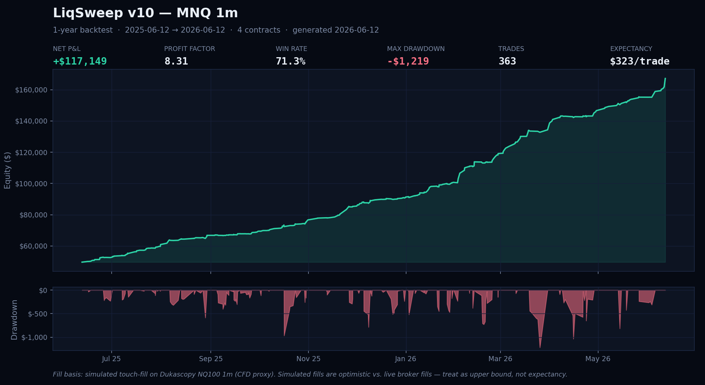

# MWM Trading Mobile (Android)

Native Kotlin / Jetpack Compose dashboard for the MWM trading platform
(`https://trading.mwmai.no`). Glanceable fleet view of every trading cell's
backtest (profit factor, net P&L, drawdown, equity sparkline), grouped per
account, plus an ad-hoc backtest runner with plain-language, chart-heavy
results — including a rotatable 3D P&L terrain showing *when* in the week a
strategy earns. Backtest data only: no live balances or daily P&L.



*Sample output: the platform's nightly 1-year backtest of the LiqSweep v10
MNQ cell (the same engine the live runner uses, refreshed every night).
Fills are simulated touch-fills on CFD-proxy data — optimistic vs. live
broker fills, so read the numbers as an upper bound.*

## 📲 Download

**[⬇ Latest APK (release)](https://github.com/Matswm86/mwm-trading-mobile/releases/latest/download/mwm-backtest.apk)**

Sideload it: open the APK on your phone and allow *install from unknown
sources* when prompted. Android 8.0+ (minSdk 26).

Alternatively, every push builds a fresh debug APK in CI: *Actions →
build-android → artifact `mwm-trading-mobile-debug-apk`* (requires a GitHub
login to download artifacts).

## Screens

- **Dashboard** — fleet hero card (cell counts, last refresh), cells grouped
  per account with LIVE/PRAC badges, per-cell equity sparkline, composite score
  and Ironclad status.
- **New backtest** — pick strategy / instrument / timeframe / window, submit to
  the platform's job queue; a notification fires when the run completes.
- **Results** — plain-English verdict card ("won $2.10 for every $1 lost…",
  luck-adjusted robustness check), equity curve, underwater drawdown chart,
  trade-outcome histogram, win/loss anatomy, exit-reason breakdown, and the 3D
  weekday × time-of-day P&L terrain (drag to rotate). Full quant stats
  (Deflated Sharpe, CPCV, bootstrap CIs) at the bottom.
- **Fleet heartbeat widget** (v0.3.0) — home-screen widget showing live health
  per account group (ok/total + status dot), market state (CME-hours aware, so
  a closed market never reads as a fault), and feed freshness. Backed by a tiny
  static JSON the server regenerates every 60s; the widget polls it every
  15 min (~2 KB) and tap = instant refresh. Goes grey/STALE if the feed itself
  stops. Display-only and battery-free by design — push alerting is handled
  server-side via [ntfy](https://ntfy.sh).

## Architecture

Thin client — all backtest compute stays server-side. Retrofit + OkHttp +
kotlinx.serialization, MVVM (ViewModel + StateFlow), Jetpack Compose with a
dependency-free Canvas charting layer (no chart libs, no GL). The 3D terrain is
a painter's-algorithm isometric projection on a plain `Canvas`.

API reads are public; the single mutating call (job submission) is gated by the
platform's reverse-proxy auth. No credentials live in this repo.

## Build locally

```bash
export JAVA_HOME=~/.jdks/temurin-17
export ANDROID_HOME=~/Android/Sdk
./gradlew assembleDebug
# APK: app/build/outputs/apk/debug/app-debug.apk
```

`local.properties` (gitignored) points Gradle at the SDK via `sdk.dir`.

See [PLAN.md](PLAN.md) for the roadmap.
